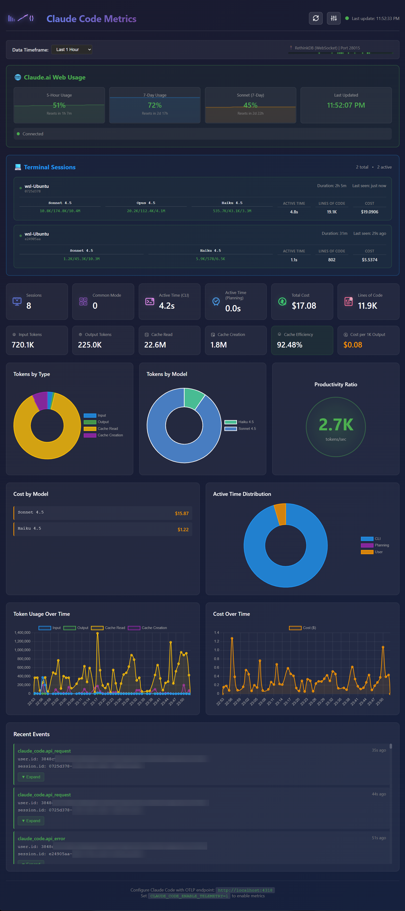

# 📊 Claude Code Metrics Dashboard

> **Ever wondered how much Claude Code is *really* costing you?** 🤔

Track your Claude Code usage in real-time with this sleek, self-hosted dashboard! Monitor tokens, costs, sessions, and more with beautiful visualizations.



---

## 🎯 What Does This Do?

This dashboard taps into Claude Code's built-in OpenTelemetry metrics to give you:

- 💰 **Real-time cost tracking** - See exactly how much you're spending
- 🎫 **Token usage analytics** - Input, output, cache read, and cache creation tokens
- ⏱️ **Time tracking** - How much time Claude spends coding vs planning vs waiting for you
- 📈 **Beautiful charts** - Powered by Chart.js with live updates
- 💾 **Persistent storage** - All your data saved in RethinkDB
- 🔄 **Real-time updates** - WebSocket-powered live data streaming
- 📱 **Session tracking** - Monitor individual coding sessions across different terminals
- ⚡ **Automatic setup** - Database initializes automatically on first run with clear error messages

### Why Would I Want This?

- **Budget tracking**: Know exactly what your AI pair programmer costs
- **Usage patterns**: See when you use Claude Code the most
- **Token optimization**: Understand your caching benefits
- **Model comparison**: Compare costs across different Claude models
- **Historical analysis**: Track your usage over time

---

## 🚀 Quick Start

Get up and running in **under 5 minutes**! The database initializes automatically—no manual setup needed.

### Prerequisites

You'll need:
- **Node.js** 14+ ([Download here](https://nodejs.org/))
- **RethinkDB** ([Installation guide](#installing-rethinkdb))
- **Claude Code** with telemetry enabled

### 1. Install RethinkDB

RethinkDB is a real-time database that makes this dashboard extra snappy with WebSocket connections.

**macOS** (via Homebrew):
```bash
brew install rethinkdb
```

**Ubuntu/Debian**:
```bash
source /etc/lsb-release && echo "deb https://download.rethinkdb.com/repository/ubuntu-$DISTRIB_CODENAME $DISTRIB_CODENAME main" | sudo tee /etc/apt/sources.list.d/rethinkdb.list
wget -qO- https://download.rethinkdb.com/repository/raw/pubkey.gpg | sudo apt-key add -
sudo apt-get update
sudo apt-get install rethinkdb
```

**Windows** or **Docker** (easiest for Windows):
```bash
docker run -d --name rethinkdb -p 28015:28015 -p 8081:8080 rethinkdb
```

**Other platforms**: See [RethinkDB installation docs](https://rethinkdb.com/docs/install/)

### 2. Start RethinkDB

```bash
rethinkdb
```

Or with Docker:
```bash
docker start rethinkdb
```

You should see RethinkDB start on:
- **Port 28015**: Database connections (this is what the dashboard uses)
- **Port 8081**: Web admin UI (optional, for database exploration)

### 3. Clone and Install

```bash
git clone https://github.com/lasswellt/cc-metrics.git
cd cc-metrics
npm install
```

### 4. Start the Dashboard

```bash
npm start
```

The dashboard will **automatically initialize the database** on first run. You should see:
```
🔌 Connecting to RethinkDB at localhost:28015...
📦 Connected to RethinkDB via WebSocket (native RethinkDB protocol)
  ✅ Created database: metrics
  ✅ Created table: metrics
  ... (additional tables and indexes)
✅ Database schema initialized

🚀 Claude Code Metrics Dashboard Started!

📡 OTLP Receiver:  http://localhost:4318
📊 Dashboard:      http://localhost:3000
```

Open [http://localhost:3000](http://localhost:3000) in your browser!

> **Note:** The database setup happens automatically—no manual configuration needed!

### 5. Configure Claude Code

Before using Claude Code, set these environment variables to enable telemetry:

**Linux/Mac:**
```bash
export CLAUDE_CODE_ENABLE_TELEMETRY=1
export OTEL_EXPORTER_OTLP_ENDPOINT=http://localhost:4318
export OTEL_EXPORTER_OTLP_PROTOCOL=http/json
export OTEL_METRICS_EXPORTER=otlp
export OTEL_LOGS_EXPORTER=otlp
```

**Windows (PowerShell):**
```powershell
$env:CLAUDE_CODE_ENABLE_TELEMETRY=1
$env:OTEL_EXPORTER_OTLP_ENDPOINT="http://localhost:4318"
$env:OTEL_EXPORTER_OTLP_PROTOCOL="http/json"
$env:OTEL_METRICS_EXPORTER="otlp"
$env:OTEL_LOGS_EXPORTER="otlp"
```

**Windows (CMD):**
```cmd
set CLAUDE_CODE_ENABLE_TELEMETRY=1
set OTEL_EXPORTER_OTLP_ENDPOINT=http://localhost:4318
set OTEL_EXPORTER_OTLP_PROTOCOL=http/json
set OTEL_METRICS_EXPORTER=otlp
set OTEL_LOGS_EXPORTER=otlp
```

**Pro tip**: Add these to your `.bashrc`, `.zshrc`, or PowerShell profile to make them permanent!

### 6. Use Claude Code Normally

That's it! Just use Claude Code like you normally would. The dashboard will automatically start collecting metrics.

---

## 🎨 Dashboard Features

### 📊 Stats Cards
Track your key metrics at a glance:
- **Total Tokens**: All tokens used (input + output + cache)
- **Total Cost**: Running total in USD
- **Active Time**: Time spent in CLI, planning, and waiting
- **Lines of Code**: Total lines modified/generated
- **Sessions**: Number of Claude Code sessions

### 📈 Interactive Charts
- **Token Usage by Type**: See the breakdown of input/output/cache tokens
- **Token Usage by Model**: Compare usage across different Claude models
- **Time Distribution**: Visualize how time is spent (CLI/Planning/User)
- **Cost Over Time**: Track spending trends
- **Token Usage Over Time**: Monitor token consumption patterns

### 🎯 Session Tracking
- Individual session details
- Per-session costs and token usage
- Terminal type identification (Browser, VS Code, etc.)
- Session start/end times

### 📅 Timeframe Selection
View metrics for:
- Last 1 hour
- Last 2 hours
- Last 3 hours
- Last 6 hours
- Last 24 hours
- Last 7 days
- Last 30 days
- All time

### ⚡ Real-Time Updates
The dashboard uses RethinkDB changefeeds for instant updates. No need to refresh—just watch the numbers roll in!

---

## 🛠️ Advanced Usage

### Database Setup

The database initializes automatically on first server start. For manual initialization or troubleshooting:

```bash
npm run setup
```

This is useful for:
- Verifying database connectivity before starting the server
- CI/CD pipelines
- Troubleshooting database issues
- Resetting database schema (idempotent, safe to run multiple times)

### Debug Mode

Get verbose logging to troubleshoot issues:

```bash
npm run debug
```

### Recalculate Stats

If your aggregated stats seem off:

```bash
npm run recalc-stats
```

### Custom Ports

Edit `server.js` to change default ports:

```javascript
const OTLP_PORT = 4318;      // OTLP receiver
const DASHBOARD_PORT = 3000;  // Web dashboard
```

### Environment Variables

Customize RethinkDB connection:

```bash
export RETHINKDB_HOST=localhost
export RETHINKDB_PORT=28015
```

---

## 🐛 Troubleshooting

### "Can't connect to RethinkDB"

If you see:
```
❌ ERROR: Cannot connect to RethinkDB
RethinkDB is not running. Please start it first:
```

The server now provides clear error messages with exact commands to fix the issue. Simply follow the on-screen instructions to start RethinkDB:

```bash
# Option 1: Local installation
rethinkdb

# Option 2: Docker
docker run -d --name rethinkdb -p 28015:28015 -p 8081:8080 rethinkdb

# Option 3: Start existing Docker container
docker start rethinkdb
```

Then restart the server with `npm start`.

### "No data appearing in dashboard"

1. Verify Claude Code environment variables are set
2. Check the server console for incoming metrics
3. Try `npm run debug` to see detailed logs
4. Visit [http://localhost:4318/api/debug/metrics](http://localhost:4318/api/debug/metrics) to see raw data

### "Port already in use"

Something else is using port 4318 or 3000:
```bash
# Find what's using the port
lsof -i :4318
lsof -i :3000

# Kill the process or change ports in server.js
```

### More help

Check out [CLAUDE.md](CLAUDE.md) for:
- Detailed architecture documentation
- Comprehensive debugging guide (9 common issues covered!)
- Development guide for contributing

---

## 🏗️ Architecture

```
Claude Code
    ↓ (OpenTelemetry OTLP)
Dashboard Server (Port 4318)
    ↓
Three parallel paths:
    ├─→ RethinkDB (persistent storage)
    ├─→ In-memory cache (last 1000 metrics)
    └─→ WebSocket (real-time updates)
    ↓
Web Dashboard (Port 3000)
```

### Tech Stack

- **Backend**: Node.js + Express
- **Database**: RethinkDB (with WebSocket support)
- **Frontend**: Vanilla JavaScript + Chart.js
- **Protocol**: OpenTelemetry Protocol (OTLP)
- **Real-time**: WebSocket + RethinkDB changefeeds

---

## 📦 What's Included

- `server.js` - Main application server with enhanced error handling
- `db-setup.js` - Reusable database initialization module
- `setup-db.js` - Standalone database setup script
- `recalc-stats.js` - Stats recalculation utility
- `public/` - Dashboard frontend (HTML/CSS/JS)
- `CLAUDE.md` - Comprehensive documentation for Claude Code
- `FIX-SUMMARY.md` - Details on the metrics aggregation fix
- `package.json` - NPM scripts including `setup` and `recalc-stats`

---

## 🤝 Contributing

Contributions welcome! This is a community project.

Ideas for contributions:
- 🎨 UI improvements
- 📊 New chart types or metrics
- 🔧 Performance optimizations
- 📚 Documentation improvements
- 🐛 Bug fixes
- 🌐 Multi-user support
- 🔐 Authentication system
- 📱 Mobile-responsive design
- 🎯 Usage alerts/notifications

**Before contributing:** Read [CLAUDE.md](CLAUDE.md) for architecture details and development guidelines.

---

## 📝 License

MIT License - see [LICENSE.txt](LICENSE.txt) for details.

**TL;DR**: Free to use, modify, and distribute. Do whatever you want with it!

---

## 🙏 Acknowledgments

- Built for the [Claude Code](https://claude.ai/code) community
- Inspired by the need to understand AI coding costs
- Powered by [OpenTelemetry](https://opentelemetry.io/)
- Made possible by [RethinkDB](https://rethinkdb.com/)

---

## 📚 Related Links

- [Claude Code Documentation](https://code.claude.com/docs/)
- [Claude Code Monitoring Guide](https://code.claude.com/docs/en/monitoring-usage)
- [OpenTelemetry Protocol](https://opentelemetry.io/docs/specs/otlp/)
- [RethinkDB Documentation](https://rethinkdb.com/docs/)
- [Chart.js Documentation](https://www.chartjs.org/)

---

## ⭐ Star This Repo!

If you find this useful, give it a star! It helps others discover this tool.

---

## 💬 Questions?

Open an issue on GitHub or check [CLAUDE.md](CLAUDE.md) for detailed documentation.

Happy coding! 🚀
